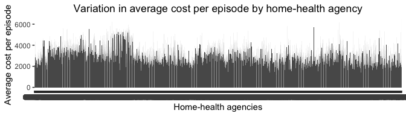
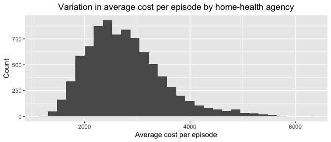
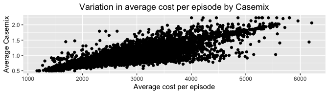
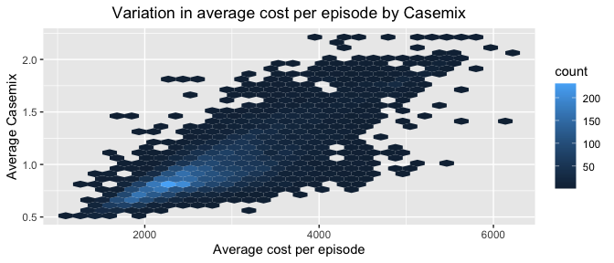
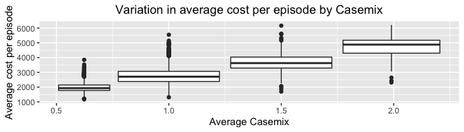
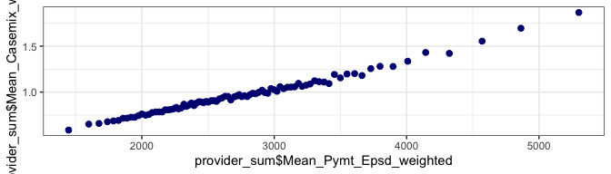
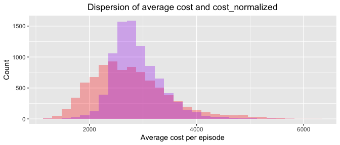

# Public Sector Application: Home Health Care (description)

The Department of Health and Human Services Office of the Inspector
General is interested in identifying home health agency that are
potentially over-billing Medicare. In prior years we have had a Harris
alum give a guest lecture about these data. Here is the report that he
would talk about. Unfortunately the guest lecturer has moved away, but
this is still a great problem set for learning about cleaning messy
data! The overarching idea of the problem set is that home health
agencies could also be billing a lot because they defrauding the
government or because they have unusually sick patients. We wouldn’t
want to punish agencies that are taking sicker patients! The data on
provider utilization is organized by codes indicating how sick a patient
is in terms of their Clinical, Functional, and Service Levels. A
case-mix of 1 corresponds to a typical patient’s expected cost. A score
of 0.75 indicates low expected costs and a score of 1.5 indicates high
expected costs.

# Data Ingestion (10 points)

Some of the variable names in the dataset do not comply with the style
guide. There is no need to change source variable names. However, if you
create a new variable, that should comply with the style guide.

\*\*1. Go to the Centers for Medicare and Medicaid Systems data portal.
Find and directly click download the Medicare Post-Acute Care & Hospice
by Provider and Service for only 2014. You should have downloaded an
unformatted csv. Open the file in spreadsheet software. What does it
mean when there is a "\*" listed in this file? Read the file into R. You
will get some warnings when you read it in. What are the warnings (hint:
use problems() in readr)? Name the data frame provider. Use test\_that
to check that you have 31665 rows.\*\*

-   What does it mean when there is a "\*" listed in this file?

Some aggregated records which are derived from 10 or fewer beneficiaries
are excluded to protect the privacy of Medicare beneficiaries and are
indicated with an asterisk. Cells are also suppressed when greater than
75% of beneficiaries have a given chronic condition or primary
diagnosis, indicated using a double asterisk (\*\*).

Source:
<https://data.cms.gov/resources/medicare-post-acute-care-hospice-by-provider-and-service-methodology>

-   Reading the file:

<!-- -->

    provider <-
      read_csv("unformatted_medicare_post_acute_care_hospice_by_provider_and_service_2014_12_31.csv")

    ## Warning: One or more parsing issues, see `problems()` for details

    ## Rows: 31665 Columns: 122
    ## ── Column specification ────────────────────────────────────────────────────────
    ## Delimiter: ","
    ## chr (78): Smry_Ctgry, State, Srvc_Ctgry, Prvdr_ID, Prvdr_Name, Prvdr_City, P...
    ## dbl (44): Bene_Dstnct_Cnt, Tot_Epsd_Stay_Cnt, Tot_Srvc_Days, Tot_Chrg_Amt, T...
    ## 
    ## ℹ Use `spec()` to retrieve the full column specification for this data.
    ## ℹ Specify the column types or set `show_col_types = FALSE` to quiet this message.

    problems(provider)

    ## # A tibble: 18 × 5
    ##      row   col expected actual file                                             
    ##    <int> <int> <chr>    <chr>  <chr>                                            
    ##  1   266    66 a double *      /Users/khristelzavaleta/Documents/GitHub/Public/…
    ##  2  5194    66 a double *      /Users/khristelzavaleta/Documents/GitHub/Public/…
    ##  3  8678    66 a double *      /Users/khristelzavaleta/Documents/GitHub/Public/…
    ##  4 12380    66 a double *      /Users/khristelzavaleta/Documents/GitHub/Public/…
    ##  5 12404    66 a double *      /Users/khristelzavaleta/Documents/GitHub/Public/…
    ##  6 13060    85 a double *      /Users/khristelzavaleta/Documents/GitHub/Public/…
    ##  7 13639    66 a double *      /Users/khristelzavaleta/Documents/GitHub/Public/…
    ##  8 15788    66 a double *      /Users/khristelzavaleta/Documents/GitHub/Public/…
    ##  9 17088    66 a double *      /Users/khristelzavaleta/Documents/GitHub/Public/…
    ## 10 17987    66 a double *      /Users/khristelzavaleta/Documents/GitHub/Public/…
    ## 11 18492    66 a double *      /Users/khristelzavaleta/Documents/GitHub/Public/…
    ## 12 20167    85 a double *      /Users/khristelzavaleta/Documents/GitHub/Public/…
    ## 13 24119    66 a double *      /Users/khristelzavaleta/Documents/GitHub/Public/…
    ## 14 24349    66 a double *      /Users/khristelzavaleta/Documents/GitHub/Public/…
    ## 15 25576    66 a double *      /Users/khristelzavaleta/Documents/GitHub/Public/…
    ## 16 26736    85 a double *      /Users/khristelzavaleta/Documents/GitHub/Public/…
    ## 17 30557    66 a double *      /Users/khristelzavaleta/Documents/GitHub/Public/…
    ## 18 31588    66 a double *      /Users/khristelzavaleta/Documents/GitHub/Public/…

-   What are the warnings (hint: use problems() in readr)?

The warning appears because R identifies a column with as a given type
(double) but there are some rows where we find other type of data, for
example a character. In this data set, we can that we have some asterisk
in the dataframe to protect privacy of Medicare beneficiaries.

-   Using test\_that:

<!-- -->

    test_that(
      "we have the right number of rows",
      expect_equal(nrow(provider), 31665)
    )

    ## Test passed 🎊

**2. Now, when before downloading the data, click dataset. You should
have downloaded a zip file. Open Provider\_by\_HHRG\_PUF\_2014 in Excel.
Read the file into R using the readxl package and name it
provider\_hhrg. Use test\_that to check that you have 111904 rows.**

-   Reading the file into R:

<!-- -->

    library(readxl)

    provider_hhrg <- read_excel("Provider_by_HHRG_PUF_2014.xlsx", sheet = "Data")

-   Using test\_that to check 111904:

<!-- -->

    test_that(
      "we have the right number of rows",
      expect_equal(nrow(provider_hhrg), 111904)
    )

    ## Test passed 😀

**3. Download Medicare’s 2014 case-mix weights (CY 2014 HH PPS case-mix
weights) from this website. Name the data frame case\_mix\_weight. Name
the variable for 2014 casemix casemix\_2014. Drop the column named “2013
HH PPS Case-Mix Weights”. Use test\_that to check that you have 153
rows.**

-   Naming the data frame, the variable and dropping the column:

<!-- -->

    case_mix_weight <- read_csv("CY 2014 Final HH PPS Case-Mix Weights.csv")

    ## Rows: 153 Columns: 5
    ## ── Column specification ────────────────────────────────────────────────────────
    ## Delimiter: ","
    ## chr (2): Description, Clinical, Functional, and Service Levels
    ## dbl (3): Payment group, 2013 HH PPS Case-Mix Weights, 2014 Final HH PPS Case...
    ## 
    ## ℹ Use `spec()` to retrieve the full column specification for this data.
    ## ℹ Specify the column types or set `show_col_types = FALSE` to quiet this message.

    case_mix_weight <- case_mix_weight %>%
      rename(
        casemix_2014 =
          `2014 Final HH PPS Case-Mix Weights`
      ) %>% # naming the variable
      select(-`2013 HH PPS Case-Mix Weights`) # Dropping the column

-   Using test\_that to check 153 rows:

<!-- -->

    test_that(
      "we have the right number of rows",
      expect_equal(nrow(case_mix_weight), 153)
    )

    ## Test passed 🥳

# Data Orientation and Validation (15 points)

**1. What are the five types of service categories in provider (this
will require some googling)?**

The five types of service categories are:

    provider %>%
      distinct(Srvc_Ctgry)

    ## # A tibble: 5 × 1
    ##   Srvc_Ctgry
    ##   <chr>     
    ## 1 HH        
    ## 2 HOS       
    ## 3 IRF       
    ## 4 LTC       
    ## 5 SNF

Also, from the data from the Centers for Medicare & Medicaid Services,
we can conclude know that the codes refers to:

HH: Home Health HOS: Hospice SNF: Skilled Nursing Facility IRF:Inpatient
Rehabilitation Facility LTC: Long-Term Care Hospital

Definitions of the service categories:

1.  Skilled nursing facility (SNF): A nursing facility with the staff
    and equipment to give skilled nursing care and/or skilled
    rehabilitation services and other related health services

2.  Inpatient rehabilitation facility (IRF): IRFs combine hospital-level
    care with intensive rehabilitation to treat patients and help them
    regain their usual functioning. It is basically a care center for
    people who need rehabilitation and have medical needs that require
    round the clock nursing care

3.  Home health agency (HH): means a public agency or private
    organization that provides skilled nursing services and at least one
    other home health service

4.  Long-term care hospital (LTC): Services that include medical and
    non-medical care provided to people who are unable to perform basic
    activities of daily living such as dressing or bathing. Long-term
    supports and services can be provided at home, in the community, in
    assisted living or in nursing homes

5.  The Medicare Health Outcomes Survey (HOS) is the first
    patient-reported outcomes measure used in Medicare managed care

Source:
<https://data.cms.gov/resources/medicare-post-acute-care-hospice-by-provider-and-service-data-dictionary>

**2. provider and provider\_hhrg contain information at three different
levels of aggregation. What are they?**

The three levels are the nation, state, and provider.

-   Using provider\_hhrg data frame:

<!-- -->

    provider_hhrg %>%
      distinct(Smry_Ctgry)

    ## # A tibble: 3 × 1
    ##   Smry_Ctgry
    ##   <chr>     
    ## 1 NATION    
    ## 2 STATE     
    ## 3 PROVIDER

-   Using provider data frame:

<!-- -->

    provider %>%
      distinct(Smry_Ctgry)

    ## # A tibble: 3 × 1
    ##   Smry_Ctgry
    ##   <chr>     
    ## 1 NATION    
    ## 2 STATE     
    ## 3 PROVIDER

**3. Using public documents, calculate how many people received home
health care benefits (Srvc\_Ctgry == “HH”) from Medicare in calendar
year 2014. Compare this to the total number of beneficiaries in
provider. Do the numbers from these sources align? If not, why do you
think they might not align?**

    provider %>%
      filter(Srvc_Ctgry == "HH") %>%
      filter(Smry_Ctgry == "NATION") %>%
      select(Smry_Ctgry, Srvc_Ctgry, Bene_Dstnct_Cnt)

    ## # A tibble: 1 × 3
    ##   Smry_Ctgry Srvc_Ctgry Bene_Dstnct_Cnt
    ##   <chr>      <chr>                <dbl>
    ## 1 NATION     HH                 3416037

Two resources have been found that refer to the number of patients
treated at home health care:

-   From the article “The Future of Home Health Care: A Strategic
    Framework for Optimizing Value”, we can conclude that the data is
    aligned, given that they also provide an approximate of 3.4 million
    people served: “Approximately 3.4 million people receive Medicare
    skilled home health care, which supports homebound patients by
    providing coverage for intermittent skilled nursing and therapy
    services that are provided by Medicare-certified physician home
    health agencies subject to a plan of care.”

Source: <https://journals.sagepub.com/doi/full/10.1177/1084822316666368>

-   According to CDC data for 2015 the total number of patients was
    4,455,651. In this regard, we can comment that this difference
    occurs in (1) because they are different years and (2) because a
    different source is used to calculate the data on patients served
    (it is mentioned in the article that it is extracted from a merge
    file).

Source: <https://www.cdc.gov/nchs/fastats/home-health-care.htm>

**4. Compare the total number of episodes in provider for home health
care and the number in provider\_hhrg. Do the numbers from these sources
align? If not, why do you think they might not align? Hint: read\_xlsx
does not automatically parse data types when loading the data, as
contrast to read\_csv. For our data, you may find readr::parse\_number
helpful in converting variables to a numerical type.**

    provider %>%
      filter(Srvc_Ctgry == "HH", Smry_Ctgry == "NATION") %>%
      select(Smry_Ctgry, Srvc_Ctgry, Tot_Epsd_Stay_Cnt)

    ## # A tibble: 1 × 3
    ##   Smry_Ctgry Srvc_Ctgry Tot_Epsd_Stay_Cnt
    ##   <chr>      <chr>                  <dbl>
    ## 1 NATION     HH                   6558889

    provider_hhrg_v1 <- provider_hhrg %>%
      mutate(Tot_Epsd_Stay_Cnt = parse_number(Tot_Epsd_Stay_Cnt))

    provider_hhrg_v1 %>%
      filter(Smry_Ctgry == "NATION") %>%
      summarise(sum(Tot_Epsd_Stay_Cnt))

    ## # A tibble: 1 × 1
    ##   `sum(Tot_Epsd_Stay_Cnt)`
    ##                      <dbl>
    ## 1                  5988839

-   Do the numbers from these sources align? If not, why do you think
    they might not align?

The numbers from provider and provider\_hhrg don’t align. In the first
one we got 6558889 total episodes while in the second one we got 5988839
total episodes. They may not align because the providers could be
inflating the numbers of episodes when reporting for the first source.
The two data frame have difference data source.

**5. Focus on just the provider-level rows in provider\_hhrg. Within
this subset of rows, what column(s) uniquely identify each row? Use a
test\_that statement to document your answer.**

-   Total number of rows that should be uniquely identify:

<!-- -->

    provider_hhrg %>%
      filter(Smry_Ctgry == "PROVIDER") %>%
      nrow()

    ## [1] 105245

-   Testing the columns that uniquely identifes ghe rows “Prvdr\_ID” and
    “Grpng”:

<!-- -->

    test <- provider_hhrg %>%
      filter(Smry_Ctgry == "PROVIDER") %>%
      distinct(Prvdr_ID, Grpng)

    test_that(
      "we have the right number of rows",
      expect_equal(nrow(test), 105245)
    )

    ## Test passed 😀

-   Example:

<!-- -->

    test_2 <- provider_hhrg %>%
      filter(Prvdr_ID == "027002", Grpng == "1AFK")

    test_that(
      "we have the right number of rows",
      expect_equal(nrow(test_2), 1)
    )

    ## Test passed 🎊

# Merge Provider Costs with Provider Case-Mix (40 points)

To assess whether a provider is overbilling, we need join the weights in
case\_mix\_weight on to provider\_hhrg. This requires some syntax that
we haven’t covered yet, so we will walk through it step-by-step.

**1. Google to find the stringr vignette and read it (or read R4DS
chapter 14). What does the str\_sub command do? What are the required
arguments? What does the str\_trim command do?**

-   str\_sub: extract character of the string from a start to an end
    position. The require arguments are the string (a character or the
    specific column in the data set), and an integer that gives the
    position: start (gives the position of the first character) and end
    (gives the position of the last).

-   str\_trim: it removes white spaces from a string. The require
    argument is the string (the character vector or the specific column
    in the data set). We can also add the side from which we want to
    remove the whitespace (left, right or both).

**2. There is no common identifer between the two datasets. However,
there is common information that can be used to link the two datasets.
Review both datasets using the View statement. What five types of
information are available in both datasets? Explain using plain English
(not copy-pasting a definition that you found online) what these five
types of information are.**

-   Reviewing the datasets:

<!-- -->

    view(provider_hhrg)
    view(case_mix_weight)

-   Information Available in both datasets: Episodes, Therapy, Clinical
    Severity Level, Functional Severity Level 1, Service Severity Level
    1

*Data frame provider\_hhrg*

    tibble(provider_hhrg$Grpng_Desc) %>%
      distinct()

    ## # A tibble: 153 × 1
    ##    `provider_hhrg$Grpng_Desc`                                                   
    ##    <chr>                                                                        
    ##  1 Early Episode, 0-13 therapies,Clinical Severity Level 1, Functional Severity…
    ##  2 Early Episode, 0-13 therapies,Clinical Severity Level 1, Functional Severity…
    ##  3 Early Episode, 0-13 therapies,Clinical Severity Level 1, Functional Severity…
    ##  4 Early Episode, 0-13 therapies,Clinical Severity Level 1, Functional Severity…
    ##  5 Early Episode, 0-13 therapies,Clinical Severity Level 1, Functional Severity…
    ##  6 Early Episode, 0-13 therapies,Clinical Severity Level 1, Functional Severity…
    ##  7 Early Episode, 0-13 therapies,Clinical Severity Level 1, Functional Severity…
    ##  8 Early Episode, 0-13 therapies,Clinical Severity Level 1, Functional Severity…
    ##  9 Early Episode, 0-13 therapies,Clinical Severity Level 1, Functional Severity…
    ## 10 Early Episode, 0-13 therapies,Clinical Severity Level 1, Functional Severity…
    ## # … with 143 more rows

*Data frame case\_mix\_weight*

    tibble(
      case_mix_weight$`Clinical, Functional, and Service Levels`,
      case_mix_weight$Description
    )

    ## # A tibble: 153 × 2
    ##    `case_mix_weight$\`Clinical, Functional, and Service Level…` `case_mix_weig…`
    ##    <chr>                                                        <chr>           
    ##  1 C1F1S1                                                       1st and 2nd Epi…
    ##  2 C1F1S2                                                       1st and 2nd Epi…
    ##  3 C1F1S3                                                       1st and 2nd Epi…
    ##  4 C1F1S4                                                       1st and 2nd Epi…
    ##  5 C1F1S5                                                       1st and 2nd Epi…
    ##  6 C1F2S1                                                       1st and 2nd Epi…
    ##  7 C1F2S2                                                       1st and 2nd Epi…
    ##  8 C1F2S3                                                       1st and 2nd Epi…
    ##  9 C1F2S4                                                       1st and 2nd Epi…
    ## 10 C1F2S5                                                       1st and 2nd Epi…
    ## # … with 143 more rows

This information addresses the characteristics of the illness and the
type of care, the description of the HHRG. Five time of information:

-   Episodes (Early or late episode): *Early episode* covers the and
    first and second episodes in an illness and the *Late episode*
    implies the third episode and beyond in an illness.
-   Therapy: Number of therapy visits
-   The following are measurement of the impact in the patient: Clinical
    Severity Level, Functional Severity Level, Service Severity Level

**3. Which column(s) in provider\_hhrg do you plan to use for joining?
How many distinct HHRG groups are there using this (these) column(s)?**

We plan to use the column Grpng\_Desc from the provider data frame.

-   Distinct HHRG groups:

<!-- -->

    tibble(provider_hhrg$Grpng_Desc) %>%
      distinct() %>%
      nrow()

    ## [1] 153

There are 153 distinct HHRG groups.

**4. Take the column(s) you chose from provider\_hhrg and separate them
into five new columns – one for each of the information types you listed
in \#1 above. Be sure to apply str\_trim() to any columns which contain
text.**

-   Separating into five new columns:

<!-- -->

    provider_hhrg_v2 <- provider_hhrg %>%
      separate(Grpng_Desc,
        c("Episode", "Therapies", "CSL", "FSL", "SVL"),
        sep = ","
      ) %>%
      mutate(
        Episode = str_trim(Episode),
        Therapies = str_trim(Therapies),
        CSL = str_trim(CSL), FSL = str_trim(FSL), SVL = str_trim(SVL)
      )

    ## Warning: Expected 5 pieces. Additional pieces discarded in 202 rows [122, 5580,
    ## 5581, 5582, 5583, 5584, 5585, 5586, 5587, 5588, 5589, 5590, 5591, 5592, 5593,
    ## 5594, 5595, 5596, 5597, 5598, ...].

**5. R will likely throw a warning " Additional pieces discarded in. . .
" followed by a series of row numbers. List three of the row numbers
returned in the warning message. Use filter(row\_number() == xx) to
check these rows by hand. Why did you get a warning for these rows? Do
you think it makes sense to drop these rows? Why or why not?**

    provider_hhrg %>%
      filter(row_number() == 122 | row_number() == 5580 | row_number() == 5581) %>%
      select(Grpng_Desc)

    ## # A tibble: 3 × 1
    ##   Grpng_Desc                                                                    
    ##   <chr>                                                                         
    ## 1 Late Episode, 14-19 therapies,Clinical Severity Level 1, Functional Severity …
    ## 2 Late Episode, 14-19 therapies,Clinical Severity Level 1, Functional Severity …
    ## 3 Late Episode, 14-19 therapies,Clinical Severity Level 1, Functional Severity …

-   Why did you get a warning for these rows? Do you think it makes
    sense to drop these rows? Why or why not?

I get a warning message because these columns terminate in a comma and
do not have a character after them, the algorithm expects 5 parts and
discards the “sixth” separator. It’s not removing the rows, but it is
rejecting the new columns that would be created (the sixth column), thus
dropping the extra column makes sense. We will clean the data, with the
final comma removed from this column. This is what we’ll do next:

-   Number of rows with the problem:

<!-- -->

    provider_hhrg %>%
      filter(endsWith(Grpng_Desc, ",")) %>%
      nrow()

    ## [1] 202

-   Deleting the commas that are located at the end of the string

<!-- -->

    clean_provider_hhrg <- provider_hhrg %>%
      mutate(
        Grpng_Desc = if_else(
          grepl(",$", provider_hhrg$Grpng_Desc),
          str_sub(Grpng_Desc, 1, nchar(Grpng_Desc) - 1),
          Grpng_Desc
        )
      )

Source:
<https://stackoverflow.com/questions/47026374/ifelse-starting-with-ends-with-includes>

-   Separating into five columns, no warning message:

<!-- -->

    provider_hhrg_v3 <- clean_provider_hhrg %>%
      separate(Grpng_Desc,
        c("Episode", "Therapies", "CSL", "FSL", "SVL"),
        sep = ","
      ) %>%
      mutate(
        Episode = str_trim(Episode),
        Therapies = str_trim(Therapies),
        CSL = str_trim(CSL), FSL = str_trim(FSL), SVL = str_trim(SVL)
      )

**6. Which column(s) in case\_mix\_weight do you plan to use for
merging? How many distinct HHRG groups are there using this (these)
column(s)?**

We plan to use the column Description" and “Clinical, Functional, and
Service Levels” from the case\_mix\_weight data frame.

-   Distinct HHRG groups:

<!-- -->

    case_mix_weight %>%
      distinct(Description, `Clinical, Functional, and Service Levels`) %>%
      nrow()

    ## [1] 153

There are 153 distinct groups.

**7. Take the column(s) you chose from case\_mix\_weight and again
separate to add five new columns – one for each of the information types
you listed in \#1 above. Be sure to apply str\_trim to any columns which
contain text. Be sure to use the same five column names as you did in
the previous question.**

-   Separating into five new columns:

<!-- -->

    case_mix_weight_v2 <- case_mix_weight %>%
      separate(Description,
        c("Episode", "Therapies"),
        sep = ","
      ) %>%
      mutate(
        Episode = str_trim(Episode),
        Therapies = str_trim(Therapies)
      ) %>%
      separate(`Clinical, Functional, and Service Levels`,
        c("CSL", "FSL", "SVL"),
        sep = c(2, 4)
      ) %>%
      mutate(
        CSL = str_trim(CSL), FSL = str_trim(FSL), SVL = str_trim(SVL)
      )

    case_mix_weight_v2

    ## # A tibble: 153 × 7
    ##    `Payment group` Episode              Therapies CSL   FSL   SVL   casemix_2014
    ##              <dbl> <chr>                <chr>     <chr> <chr> <chr>        <dbl>
    ##  1           10111 1st and 2nd Episodes 0 to 5 T… C1    F1    S1           0.608
    ##  2           10112 1st and 2nd Episodes 6 Therap… C1    F1    S2           0.727
    ##  3           10113 1st and 2nd Episodes 7 to 9 T… C1    F1    S3           0.847
    ##  4           10114 1st and 2nd Episodes 10 Thera… C1    F1    S4           0.966
    ##  5           10115 1st and 2nd Episodes 11 to 13… C1    F1    S5           1.09 
    ##  6           10121 1st and 2nd Episodes 0 to 5 T… C1    F2    S1           0.763
    ##  7           10122 1st and 2nd Episodes 6 Therap… C1    F2    S2           0.866
    ##  8           10123 1st and 2nd Episodes 7 to 9 T… C1    F2    S3           0.968
    ##  9           10124 1st and 2nd Episodes 10 Thera… C1    F2    S4           1.07 
    ## 10           10125 1st and 2nd Episodes 11 to 13… C1    F2    S5           1.17 
    ## # … with 143 more rows

**8. A successful join requires both datasets to have the same values in
addition to the same column names. For each of the five new columns, run
count() in both datasets. Which of the column(s) have the same values in
both datasets? Which of the column(s) have similar values, but require
further cleanup? Read about str\_sub() command in Section 14 as well as
fct\_recode() and fct\_collapse() commands in section 15.5. Use these
commands to fix the columns in case\_mix\_weight to ensure that the five
columns have identical values to provider\_hhrg.**

-   Running count for each of the five new columns in the provider\_hhrg
    data frame:

<!-- -->

    provider_hhrg_v3 %>%
      count(Episode)

    ## # A tibble: 3 × 2
    ##   Episode                   n
    ##   <chr>                 <int>
    ## 1 Early Episode         81164
    ## 2 Early or Late Episode  6116
    ## 3 Late Episode          24624

    provider_hhrg_v3 %>%
      count(Therapies)

    ## # A tibble: 3 × 2
    ##   Therapies           n
    ##   <chr>           <int>
    ## 1 0-13 therapies  88561
    ## 2 14-19 therapies 17227
    ## 3 20+ therapies    6116

    provider_hhrg_v3 %>%
      count(CSL)

    ## # A tibble: 3 × 2
    ##   CSL                           n
    ##   <chr>                     <int>
    ## 1 Clinical Severity Level 1 32070
    ## 2 Clinical Severity Level 2 38689
    ## 3 Clinical Severity Level 3 41145

    provider_hhrg_v3 %>%
      count(FSL)

    ## # A tibble: 3 × 2
    ##   FSL                             n
    ##   <chr>                       <int>
    ## 1 Functional Severity Level 1 15244
    ## 2 Functional Severity Level 2 64275
    ## 3 Functional Severity Level 3 32385

    provider_hhrg_v3 %>%
      count(SVL)

    ## # A tibble: 5 × 2
    ##   SVL                          n
    ##   <chr>                    <int>
    ## 1 Service Severity Level 1 59936
    ## 2 Service Severity Level 2 12154
    ## 3 Service Severity Level 3 19606
    ## 4 Service Severity Level 4  7081
    ## 5 Service Severity Level 5 13127

-   Running count for each of the five new columns in the
    case\_mix\_weight data frame:

<!-- -->

    case_mix_weight_v2 %>%
      count(Episode)

    ## # A tibble: 3 × 2
    ##   Episode                  n
    ##   <chr>                <int>
    ## 1 1st and 2nd Episodes    72
    ## 2 3rd+ Episodes           72
    ## 3 All Episodes             9

    case_mix_weight_v2 %>%
      count(Therapies)

    ## # A tibble: 9 × 2
    ##   Therapies                   n
    ##   <chr>                   <int>
    ## 1 0 to 5 Therapy Visits      18
    ## 2 10 Therapy Visits          18
    ## 3 11 to 13 Therapy Visits    18
    ## 4 14 to 15 Therapy Visits    18
    ## 5 16 to 17 Therapy Visits    18
    ## 6 18 to 19 Therapy Visits    18
    ## 7 20+ Therapy Visits          9
    ## 8 6 Therapy Visits           18
    ## 9 7 to 9 Therapy Visits      18

    case_mix_weight_v2 %>%
      count(CSL)

    ## # A tibble: 3 × 2
    ##   CSL       n
    ##   <chr> <int>
    ## 1 C1       51
    ## 2 C2       51
    ## 3 C3       51

    case_mix_weight_v2 %>%
      count(FSL)

    ## # A tibble: 3 × 2
    ##   FSL       n
    ##   <chr> <int>
    ## 1 F1       51
    ## 2 F2       51
    ## 3 F3       51

    case_mix_weight_v2 %>%
      count(SVL)

    ## # A tibble: 5 × 2
    ##   SVL       n
    ##   <chr> <int>
    ## 1 S1       45
    ## 2 S2       36
    ## 3 S3       36
    ## 4 S4       18
    ## 5 S5       18

-   Which of the column(s) have the same values in both datasets? Which
    of the column(s) have similar values, but require further cleanup?

Although no two columns have precisely the same data, CSL, FSL, and SVL
contain highly similar data that can be readily standardized with the
corresponding provider hhrg data frame. Episodes and Therapies, on the
other hand, will need data modification in order to be equivalent.

-   Fixing columns in case\_mix\_weight:

*Making uniform columns CSL, FSL and SVL:*

    case_mix_weight_v3 <- case_mix_weight_v2 %>%
      mutate(CSL = fct_recode(CSL,
        "Clinical Severity Level 1" = "C1",
        "Clinical Severity Level 2" = "C2",
        "Clinical Severity Level 3" = "C3"
      ), FSL = fct_recode(FSL,
        "Functional Severity Level 1" = "F1",
        "Functional Severity Level 2" = "F2",
        "Functional Severity Level 3" = "F3"
      ), SVL = fct_recode(SVL,
        "Service Severity Level 1" = "S1",
        "Service Severity Level 2" = "S2",
        "Service Severity Level 3" = "S3",
        "Service Severity Level 4" = "S4",
        "Service Severity Level 5" = "S5"
      ))

    # Output:

    case_mix_weight_v3 %>%
      count(CSL)

    ## # A tibble: 3 × 2
    ##   CSL                           n
    ##   <fct>                     <int>
    ## 1 Clinical Severity Level 1    51
    ## 2 Clinical Severity Level 2    51
    ## 3 Clinical Severity Level 3    51

    case_mix_weight_v3 %>%
      count(FSL)

    ## # A tibble: 3 × 2
    ##   FSL                             n
    ##   <fct>                       <int>
    ## 1 Functional Severity Level 1    51
    ## 2 Functional Severity Level 2    51
    ## 3 Functional Severity Level 3    51

    case_mix_weight_v3 %>%
      count(SVL)

    ## # A tibble: 5 × 2
    ##   SVL                          n
    ##   <fct>                    <int>
    ## 1 Service Severity Level 1    45
    ## 2 Service Severity Level 2    36
    ## 3 Service Severity Level 3    36
    ## 4 Service Severity Level 4    18
    ## 5 Service Severity Level 5    18

*Fixing column “Therapies”:*

    case_mix_weight_v4 <- case_mix_weight_v3 %>%
      mutate(Therapies = fct_collapse(Therapies,
        "0-13 therapies" = c(
          "0 to 5 Therapy Visits",
          "10 Therapy Visits",
          "11 to 13 Therapy Visits",
          "6 Therapy Visits",
          "7 to 9 Therapy Visits"
        ), "14-19 therapies" = c(
          "14 to 15 Therapy Visits",
          "16 to 17 Therapy Visits",
          "18 to 19 Therapy Visits"
        ),
        "20+ therapies" = c("20+ Therapy Visits")
      ))

    case_mix_weight_v4 %>%
      count(Therapies)

    ## # A tibble: 3 × 2
    ##   Therapies           n
    ##   <fct>           <int>
    ## 1 0-13 therapies     90
    ## 2 14-19 therapies    54
    ## 3 20+ therapies       9

*Fixing column “Episode”:*

For this column with take into consideration the following information:
(a) Early episodes are the first and second episodes in an illness. (b)
Late episodes are any episode after the second episode in an illness.

Source:<https://www.cms.gov/Research-Statistics-Data-and-Systems/Statistics-Trends-and-Reports/Medicare-Provider-Charge-Data/Downloads/PAC-Methodology.pdf>

    case_mix_weight_v5 <- case_mix_weight_v4 %>%
      mutate(Episode = fct_recode(Episode,
        "Early Episode" = "1st and 2nd Episodes",
        "Late Episode" = "3rd+ Episodes",
        "Early or Late Episode" = "All Episodes"
      ))

    case_mix_weight_v5 %>%
      count(Episode)

    ## # A tibble: 3 × 2
    ##   Episode                   n
    ##   <fct>                 <int>
    ## 1 Early Episode            72
    ## 2 Late Episode             72
    ## 3 Early or Late Episode     9

**9. Create a new data frame called provider\_hhrg\_wt by joining
case\_mix\_weight to provider\_hhrg. Here are two tests to check that
your join worked: (a) use test\_that to check that provider\_hhrg\_wt
has 111904 rows, (b) show that casemix\_2014 is non-missing for all the
rows.**

-   Creating the new data frame:

<!-- -->

    provider_hhrg_wt <- provider_hhrg_v3 %>%
      left_join(case_mix_weight_v5, by = c(
        "Episode", "Therapies",
        "CSL", "FSL", "SVL"
      ))

    view(provider_hhrg_wt)

-   1.  Testing for having 111904 rows:

<!-- -->

    test_that(
      "we have the right number of rows",
      expect_equal(nrow(provider_hhrg_wt), 111904)
    )

    ## Test passed 🎉

-   1.  Showing that casemix\_2014 doesn’t has missing values:

<!-- -->

    sum(is.na(provider_hhrg_wt$casemix_2014))

    ## [1] 0

# Billing Outlier Analysis (25 points)

Construct a data frame provider\_sum with one row per Provider ID. Each
provider serves many groups of patients (each with their own row in
provider\_hhrg). You will need to describe the provider’s “average
billing behavior. The new data frame should have the following columns:

Provider ID • provider name • state • mean medicare payment amount per
episode (weighted by total episodes within each group) • mean patient
case mix (weighted by total episodes within each group) • total number
of total episodes.

Hint: mean puts equal weight on each observation so you will need to
find a different summary function to construct this dataset.

For each question below, please follow the four-part approach laid out
in lecture. I have given you the question (step 1). You should write out
your query (step 2), show the plot or table that results from this query
(step 3), and write out the answer to the question in a sentence (step
4).

    provider_hhrg_wt_v1 <- provider_hhrg_wt %>%
      filter(Smry_Ctgry == "PROVIDER") %>% # We are just going to work with PROVIDER
      distinct(Prvdr_ID, Prvdr_Name, State)

    provider_hhrg_wt_v1

    ## # A tibble: 8,652 × 3
    ##    State Prvdr_ID Prvdr_Name                                  
    ##    <chr> <chr>    <chr>                                       
    ##  1 AK    027002   HOSPICE & HOME CARE OF JUNEAU               
    ##  2 AL    017009   ALACARE HOME HEALTH & HOSPICE               
    ##  3 AL    017014   AMEDISYS HOME HEALTH OF BLOUNTSVILLE        
    ##  4 AL    017016   SOUTHEAST ALABAMA HOMECARE                  
    ##  5 AL    017018   GENTIVA HEALTH SERVICES                     
    ##  6 AL    017024   SOUTHEAST ALABAMA HOMECARE                  
    ##  7 AL    017025   SAAD HEALTHCARE                             
    ##  8 AL    017034   MERCY MEDICAL HOME HEALTH                   
    ##  9 AL    017035   INFIRMARY HOMECARE OF MOBILE                
    ## 10 AL    017051   AMEDISYS HOME HEALTH LAKESHORE OF BIRMINGHAM
    ## # … with 8,642 more rows

-   Creating the mean medicare payment amount per episodw, the mean
    patient case mix and the total number of total episodes:

<!-- -->

    provider_sum <- provider_hhrg_wt %>% # Converting to numeric values
      mutate(
        Avg_Pymt_Amt_Per_Epsd = parse_number(Avg_Pymt_Amt_Per_Epsd),
        Tot_Epsd_Stay_Cnt = parse_number(Tot_Epsd_Stay_Cnt)
      ) %>%
      filter(Smry_Ctgry == "PROVIDER") %>%
      group_by(Prvdr_ID) %>%
      summarise(
        Mean_Pymt_Epsd_weighted =
          sum(Avg_Pymt_Amt_Per_Epsd * Tot_Epsd_Stay_Cnt) / sum(Tot_Epsd_Stay_Cnt),
        Mean_Casemix_weighted =
          sum(casemix_2014 * Tot_Epsd_Stay_Cnt) / sum(Tot_Epsd_Stay_Cnt),
        Total_number_episodes = sum(Tot_Epsd_Stay_Cnt)
      ) %>%
      left_join(provider_hhrg_wt_v1, by = "Prvdr_ID") %>%
      select(
        Prvdr_ID, Prvdr_Name, State, Mean_Pymt_Epsd_weighted,
        Mean_Casemix_weighted, Mean_Casemix_weighted, Total_number_episodes
      )

    provider_sum

    ## # A tibble: 8,652 × 6
    ##    Prvdr_ID Prvdr_Name  State Mean_Pymt_Epsd_… Mean_Casemix_we… Total_number_ep…
    ##    <chr>    <chr>       <chr>            <dbl>            <dbl>            <dbl>
    ##  1 017009   ALACARE HO… AL               2379.            0.982            11659
    ##  2 017013   GENTIVA HE… AL               2831.            1.27               640
    ##  3 017014   AMEDISYS H… AL               2408.            0.910              481
    ##  4 017016   SOUTHEAST … AL               2084.            0.836              790
    ##  5 017018   GENTIVA HE… AL               2599.            1.12              2460
    ##  6 017020   AMEDISYS H… AL               2241.            0.946             1007
    ##  7 017024   SOUTHEAST … AL               2054.            0.839             1783
    ##  8 017025   SAAD HEALT… AL               2465.            1.01              2184
    ##  9 017026   GENTIVA HE… AL               3198.            1.41              1085
    ## 10 017027   HGA HOMECA… AL               2324.            1.03              1704
    ## # … with 8,642 more rows

**1. Question: How much variation is there in average cost per episode
by home-health agency?**

Assuming that for home-health agency it is referring to “by provider”:

    ggplot(provider_sum) +
      geom_histogram(aes(
        x = Prvdr_ID,
        y = Mean_Pymt_Epsd_weighted
      ), stat = "identity") +
      ggtitle("Variation in average cost per episode by home-health agency") +
      theme(plot.title = element_text(hjust = 0.5)) +
      labs(y = "Average cost per episode", x = "Home-health agencies")

    ggplot(provider_sum) +
      geom_histogram(aes(x = Mean_Pymt_Epsd_weighted)) +
      ggtitle("Variation in average cost per episode by home-health agency") +
      theme(plot.title = element_text(hjust = 0.5)) +
      labs(y = "Count", x = "Average cost per episode")

We can observe from the graphs that the average cost of each episode
varies considerably on the axis. For example, in figure two, we can see
that the data ranges from slightly over 1,000 to more than 6,000.
However, we can observe that there is a data concentration between 2200
and 3200. Therefore, we can say that the data distribution is
bell-shaped and near to “normal.” Figure 1 shows that several providers
have significant data spikes, indicating that the high values are not
due to a single source or provider.

**2. Question: How much variation is there in average cost after
accounting for how sick patients are via casemix? Show three different
ways to depict the covariation of these two variables. Then explain
which plot you prefer to answer the question and why.**

    ggplot(provider_sum) +
      geom_point(aes(x = Mean_Pymt_Epsd_weighted, y = Mean_Casemix_weighted)) +
      ggtitle("Variation in average cost per episode by Casemix") +
      theme(plot.title = element_text(hjust = 0.5)) +
      labs(y = "Average Casemix", x = "Average cost per episode")

-   Three different ways to depict the covariation:

*Using geom\_hex*

    ggplot(provider_sum) +
      geom_hex(aes(x = Mean_Pymt_Epsd_weighted, y = Mean_Casemix_weighted)) +
      ggtitle("Variation in average cost per episode by Casemix") +
      theme(plot.title = element_text(hjust = 0.5)) +
      labs(y = "Average Casemix", x = "Average cost per episode")

*Using boxplot*

    ggplot(provider_sum) +
      geom_boxplot(aes(
        x = Mean_Casemix_weighted, y = Mean_Pymt_Epsd_weighted,
        group = cut_width(Mean_Casemix_weighted, 0.5)
      )) +
      ggtitle("Variation in average cost per episode by Casemix") +
      theme(plot.title = element_text(hjust = 0.5)) +
      labs(y = "Average cost per episode", x = "Average Casemix")

*Using binscatter*

    binsreg(
      provider_sum$Mean_Casemix_weighted,
      provider_sum$Mean_Pymt_Epsd_weighted
    )

    ## Call: binsreg
    ## 
    ## Binscatter Plot
    ## Bin selection method (binsmethod)  =  IMSE direct plug-in
    ## Placement (binspos)                =  Quantile-spaced
    ## Derivative (deriv)                 =  0
    ## 
    ## Group (by)                         =  Full Sample
    ## Sample size (n)                    =  8652
    ## # of distinct values (Ndist)       =  8650
    ## # of clusters (Nclust)             =  NA
    ## dots, degree (p)                   =  0
    ## dots, smooth (s)                   =  0
    ## # of bins (nbins)                  =  87

To answer the question we prefer to use the binscatter because this
graph shows us in a more direct way the direct relationship between the
average cost and the how sick patients are.

-   How much variation is there in average cost after accounting for how
    sick patients are via casemix?

Taking into consideration the severity of the patients’ illnesses by
casemix, we may conclude that there is very little (almost non)
variation in the data. The price and the severity of the patient’s
illness are inextricably linked. We can see a positive correlation
between the two factors, and the more serious the illness, the higher
the average price of each episode will be.

**3. For each HHA, construct a new cost\_normalized variable which is
the ratio of average cost to the average case-mix. Question: Is there
more dispersion in average cost or cost\_normalized? Why does one have
less dispersion than the other? Answer this question with a plot, not a
statistic. You might find it helpful to find and link to a stack
overflow thread on overlaying histograms with ggplot2.)**

-   Creating the new variable cost\_normalized:

<!-- -->

    provider_sum_v1 <- provider_sum %>%
      mutate(cost_normalized = Mean_Pymt_Epsd_weighted / Mean_Casemix_weighted)

    ggplot(provider_sum_v1) +
      geom_histogram(aes(x = Mean_Pymt_Epsd_weighted), fill = "red", alpha = 0.3) +
      geom_histogram(aes(x = cost_normalized), fill = "purple", alpha = 0.3) +
      ggtitle("Dispersion of average cost and cost_normalized") +
      theme(plot.title = element_text(hjust = 0.5)) +
      labs(y = "Count", x = "Average cost per episode")

Source:
<https://stackoverflow.com/questions/6957549/overlaying-histograms-with-ggplot2-in-r>

-   Is there more dispersion in average cost or cost\_normalized? Why
    does one have less dispersion than the other?

There is more dispersion in the average cost. Because the average cost
variable does not account for the severity of the patient’s sickness, we
may claim that the average cost variable has higher dispersion than
cost\_normalized. For the construction of the variable cost\_normalized,
the average cost was divided by case\_mix and therefore when the disease
is more severe it pushes the cost normalized variable lower, whereas if
the disease is less severe it drives it higher. That is, the data are
normalized based on the severity of the illness. Therefore, we may infer
that the variable cost normalized is a preferable source of analysis.

**4. Question: What are the top 5 HHAs with the highest billing per
episode in Illinois? What might happen if OIG decided to try to push
down costs at the 5 HHAs with the highest billing per episode in
Illinois (unadjusted for case mix)? What are the top 5 HHAs with the
highest markups (billing per episode after normalizing for case mix) in
Illinois? Is there any overlap between these two lists?**

-   Top 5 HHAs with the highest billing per episode in Illinois

<!-- -->

    provider_sum_v1 %>%
      filter(State == "IL") %>%
      arrange(desc(Mean_Pymt_Epsd_weighted)) %>%
      head(5) %>%
      select(-Total_number_episodes, -cost_normalized)

    ## # A tibble: 5 × 5
    ##   Prvdr_ID Prvdr_Name                    State Mean_Pymt_Epsd_… Mean_Casemix_we…
    ##   <chr>    <chr>                         <chr>            <dbl>            <dbl>
    ## 1 147898   FORUM HEALTH CARE             IL               5325.             1.87
    ## 2 148204   SIMPLY HOME HEALTH, LLC       IL               5110.             1.84
    ## 3 148203   AL-SHAFA HEALTH CARE, INC     IL               5040.             1.76
    ## 4 148318   LKB HEALTH CARE, LTD          IL               4766.             1.91
    ## 5 148244   ADVANCED FAMILY HOME HEALTH … IL               4482.             1.76

-   What might happen if OIG decided to try to push down costs at the 5
    HHAs with the highest billing per episode in Illinois (unadjusted
    for case mix)?

<!-- -->

    provider_sum_v1 %>%
      filter(State == "IL") %>%
      arrange(desc(Mean_Casemix_weighted)) %>%
      head(5) %>%
      select(Prvdr_ID, Prvdr_Name, Mean_Casemix_weighted)

    ## # A tibble: 5 × 3
    ##   Prvdr_ID Prvdr_Name                Mean_Casemix_weighted
    ##   <chr>    <chr>                                     <dbl>
    ## 1 148318   LKB HEALTH CARE, LTD                       1.91
    ## 2 147898   FORUM HEALTH CARE                          1.87
    ## 3 148204   SIMPLY HOME HEALTH, LLC                    1.84
    ## 4 148187   WHITESTAR HOME HEALTH INC                  1.84
    ## 5 148203   AL-SHAFA HEALTH CARE, INC                  1.76

The chart above shows that the providers with the highest billing per
episode are also the ones who handle the most complex cases of illness.
As a result, decreasing expenses may lead to these providers refusing to
treat the sickest patients since it is inconvenient for them to do so.

-   Top 5 HHAs with the highest markups in Illinois:

<!-- -->

    provider_sum_v1 %>%
      filter(State == "IL") %>%
      arrange(desc(cost_normalized)) %>%
      head(5)

    ## # A tibble: 5 × 7
    ##   Prvdr_ID Prvdr_Name   State Mean_Pymt_Epsd_… Mean_Casemix_we… Total_number_ep…
    ##   <chr>    <chr>        <chr>            <dbl>            <dbl>            <dbl>
    ## 1 147855   CARE SOLUTI… IL               3059.            0.708              260
    ## 2 148137   ALPHONSA HO… IL               3227.            0.783              177
    ## 3 148192   ALTERNATIVE… IL               3421.            0.839              101
    ## 4 147923   ASPEN HOME … IL               3001.            0.743               70
    ## 5 147854   CHICAGOLAND… IL               2914.            0.742              433
    ## # … with 1 more variable: cost_normalized <dbl>

We can see that there is no overlap between these two constructions of
the top5, therefore, the theory that decisions cannot be made from the
first table is stronger.
